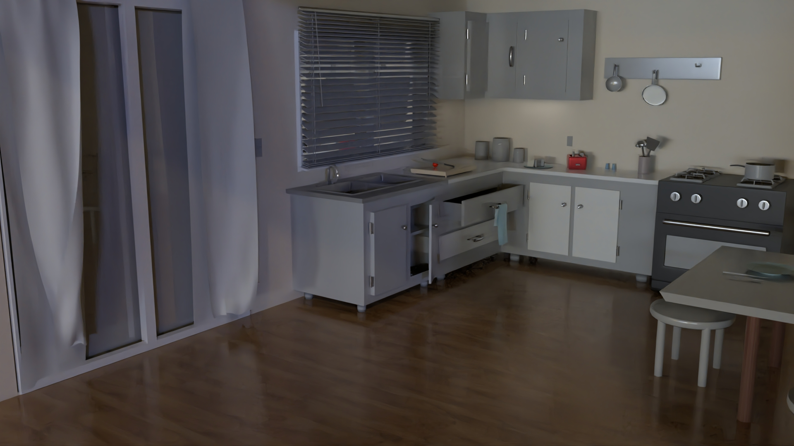

# Renderer_Conversion_Tool
## version 1.0

This tool can be used to convert whole scene from one renderer to another in Autodesk Maya. The tool is also flexible enough to accomodate any new material to be added as per requirement and if any renderer is added in Autodesk Maya. The whole conversion works using the dictionary files.

Currently, the supported renderers are : 
1.  Autodesk Arnold
2.  Pixar's Renderman 
3.  Chaos Group's V-Ray.

*   The supported materials are :
1.  Arnold - aiStandardSurface & aiStandardHair
2.  Renderman - PxrDisneyBSDF & PxrMarschnerHair
3.  V-Ray - VRayMtl & VRayHairNextMtl

*   The supported lights are :
1.  Arnold - aiAreaLight,pointLight,directionalLight,spotLight,aiSkyDomeLight and aiMeshLight
2.  Renderman - PxrRectLight, PxrSphereLight, PxrDistantLight, PxrDiskLight, PxrDomeLight and PxrMeshLight
3.  V-Ray - VRayLightRectShape, VRayLightSphere, VRaySunShape, VRayLightIESShape, VRayLightDomeShape and VRayLightMesh 

## Installation
* Download the complete zip folder including the dictionary files and paste it in the scripts folder of Maya.
* Load the code and save it as a shelf button if required.

## How to use
1.  Open a completed scene to be rendered in any of the supported renderers.

2.  Click on the shelf button to launch the tool  

3.  For material conversion - select all the objects, select "From:" and "To:" renderer and click on "Convert button"

4.  For light conversion - select all the lights, select "From:" and "To:" renderer and click on "Convert button"

5.  Done. Select Render as the default renderer as already been changed to the converted one.

## Video demonstrating the tool

# Scene rendered using Arnold

# Scene converted from Arnold to V-Ray and rendered

# Same scene converted from V-Ray to Renderman

## Video Demonstrating the tool

## Test renders of different scenes (Always in this order : Arnold, Renderman, VRay)
*   Scene 2

*   Scene 3

*   Scene 4

*   Scene 5

*   Scene 6

## Required Packages/Modules
* If the user has Python, Autodesk Maya and all the supported renderers installed on their devices then the tool doesn't require any other package/module.

## Credits
Created by :
* Shubham Prabhakar
* M.Sc. Computer Animation and Visual Effects
* Bournemouth University
